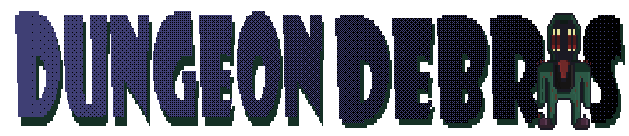

This is a raycaster dungeon crawler in fake 3D and my game jam submission for the [Brackeys Game Jam 2026.1](https://itch.io/jam/brackeys-15).

You can play my entry on itch.io [here](https://richardbaltrusch.itch.io/dungeon-debris).

## How to run

Open the project in the Godot game engine, then run it with F5.

Built using Godot 4.4-stable.

## License

The code is available under the [MIT License](LICENSE). The artwork and audio is not included under this licensing and may only be used jointly with the code provided in this repository for non-commercial purposes. Redistribution of the artwork and audio requires permission of the author.
